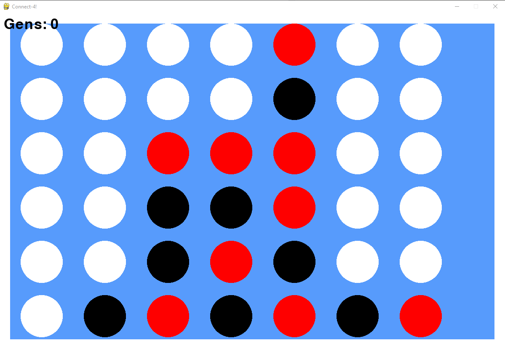

# Connect4AI
Neural network to train AI to play Connect 4

# How to run
1. Run `Connect4.py`

# Configurations
1. Comment out line `576` to skip training and begin testing on pre-trained model. Running line `576` will overwrite the model
2. Generations to train until stopping: line `567`
3. Play against the computer after training: line `582`

# Training
Due to the nature of the game, we can have up to [1.0 * 10^20 possible states](https://math.stackexchange.com/questions/301106/how-many-different-game-situations-has-connect-four) meaning the neural network will become quite complex. The model does struggle with the basic concept of blocking your opponent from getting 4. I was considering adding this into a weight function, but decided to leave it. Theoretically, running with a fitness based strictly on wins and losses, would lead the model to make that conclusion at some point.

# Consensus
Adding fitnesses based on blocking and getting 3 in a row and 2 in a row (rather than just wins and losses) might aid the network in improving faster.

